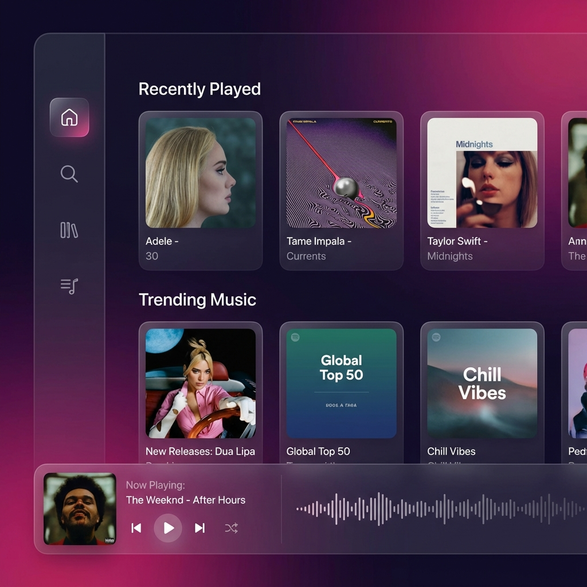
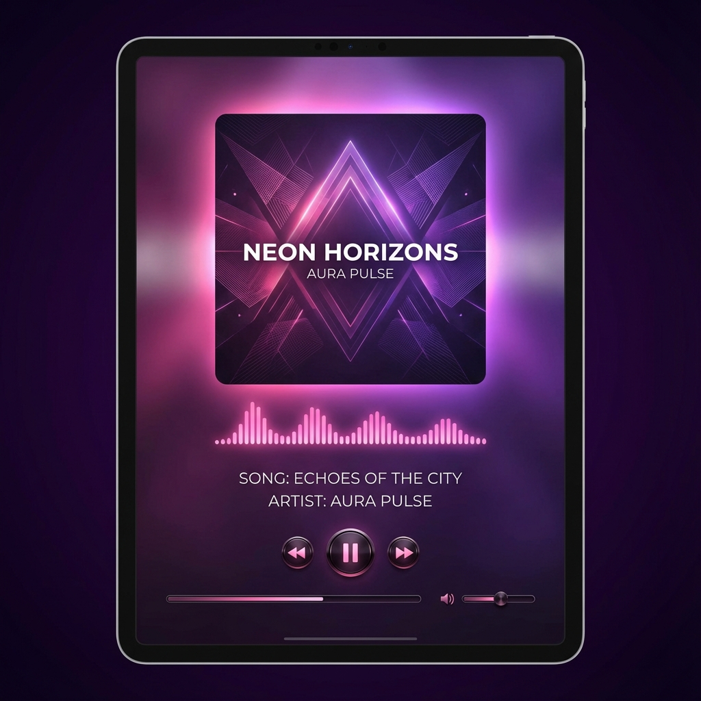
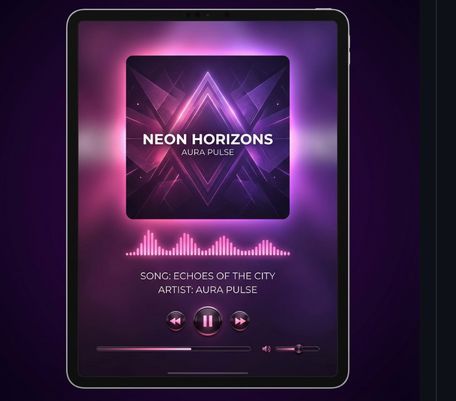

<div align="center">


# Streamify

### A Simple Music Streaming App 🎵

[](LICENSE)
[](https://github.com/Aliciamaye/Streamify)
[](https://github.com/Aliciamaye/Streamify/releases)

**A cross-platform music streaming app with a beautiful interface and powerful features.**

[Download](#-download) • [Features](#-features) • [Screenshots](#-screenshots) • [FAQ](#-faq)

</div>

---

## ✨ Features

- 🎧 **Play music for free** - Stream millions of songs without ads
- 🔍 **Smart Search** - Find any song, artist, or album instantly
- 🎤 **Search by Lyrics** - Forgot the song name? Search by lyrics!
- 📝 **Synced Lyrics** - View time-synced lyrics while listening
- 🎨 **6 Beautiful Themes** - Midnight, Nebula, Arctic, Sunset, Ocean, Forest
- 📊 **Listening Analytics** - See your top tracks, artists, and genres
- 🎯 **AI Recommendations** - Discover new music based on your taste
- 📥 **Offline Mode** - Download and play without internet
- 🔄 **Background Playback** - Keep listening while using other apps
- ⏰ **Sleep Timer** - Fall asleep to your favorite music
- 🎚️ **Equalizer** - Customize your audio experience
- 🔗 **Spotify Import** - Import your playlists from Spotify
- 🍎 **Apple Music Sync** - Connect your Apple Music library
- 📻 **Last.fm Scrobbling** - Track your listening history
- 💬 **Discord Rich Presence** - Show friends what you're playing
- 🖥️ **Desktop App** - Available for Windows, macOS, and Linux
- 📱 **Web App** - Works in any modern browser
- 🌙 **Dark Mode** - Easy on your eyes

---

## 📸 Screenshots

<div align="center">

| Home | Now Playing |
|:---:|:---:|
|  |  |

</div>

<div align="center">

### Tablet View


</div>

---

## 📥 Download

### Web App
Just visit our website and start streaming instantly!

### Desktop App
| Platform | Download |
|----------|----------|
| Windows | `.exe` installer |
| macOS | `.dmg` installer |
| Linux | `.AppImage` |

> **Coming Soon:** Mobile apps for iOS and Android

---

## 🚀 Getting Started

### Quick Setup

```bash
# Clone the repository
git clone https://github.com/Aliciamaye/Streamify.git

# Install and run
cd Streamify
npm install
npm run dev
```

### Requirements
- Node.js 18 or higher
- Modern web browser

---

## 🎨 Themes

| Theme | Style |
|-------|-------|
| 🌙 **Midnight** | Deep blues and purples |
| 🌌 **Nebula** | Cosmic purples and pinks |
| ❄️ **Arctic** | Cool blues and whites |
| 🌅 **Sunset** | Warm oranges and reds |
| 🌊 **Ocean** | Teals and aqua blues |
| 🌲 **Forest** | Natural earth tones |

---

## 📊 Data Sources

Streamify uses multiple sources to provide the best experience:

- **Lyrics**: LRCLIB, Musixmatch, Genius
- **Music Metadata**: Multiple aggregated sources
- **Canvas Backgrounds**: Various providers
- **Sponsor Skipping**: SponsorBlock integration

---

## 🔒 Privacy

- **No tracking or analytics** in the open-source version
- **Your data stays local** - playlists and preferences stored on your device
- **No third-party data sharing** - we respect your privacy
- **Open source** - verify the code yourself

---

## ❓ FAQ

### Why the name "Streamify"?
It's simple: **Stream** + **fy** (like Spotify). A clean name for a clean music experience.

### Is it free?
Yes! Streamify is completely free and open source.

### Can I import my Spotify playlists?
Yes! Connect your Spotify account and import all your playlists with one click.

### Does it work offline?
Yes! Download your favorite songs and playlists for offline playback.

### What platforms are supported?
- Web: Any modern browser
- Desktop: Windows, macOS, Linux
- Mobile: Coming soon!

---

## 👨‍💻 Developer

<table>
<tr>
<td align="center">
<a href="https://github.com/Aliciamaye">

<br />
<sub><b>Aliciamaye</b></sub>
</a>
<br />
<sub>Founder & Developer</sub>
</td>
</tr>
</table>

**Contributions are welcome!** Feel free to open issues or submit pull requests.

---

## 💖 Support

If you enjoy Streamify, please consider:

- ⭐ **Star this repo** - It helps others discover the project
- 🐛 **Report bugs** - Help us improve
- 💡 **Suggest features** - We love new ideas
- 🔀 **Contribute** - PRs are always welcome

---

## 📝 License

This project is licensed under the **MIT License** - see the [LICENSE](LICENSE) file for details.

---

<div align="center">

### Made with ❤️ and 🎵

**[⭐ Star this repo](https://github.com/Aliciamaye/Streamify)** if you love music!

</div>
